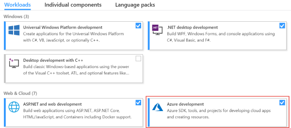
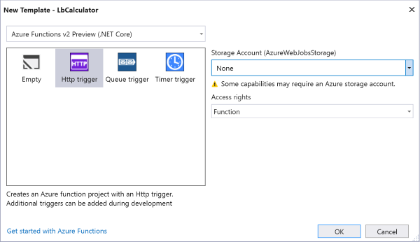
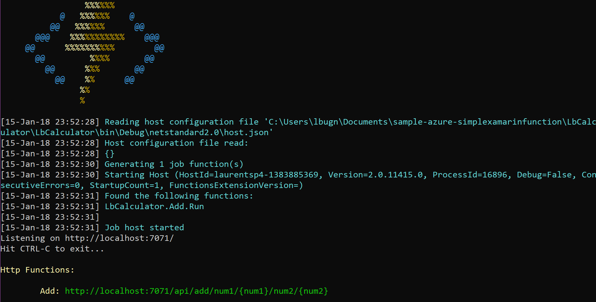
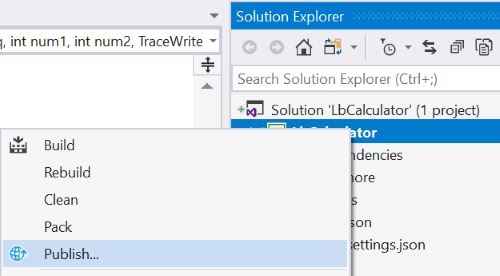
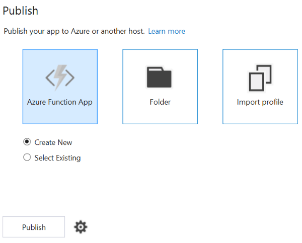
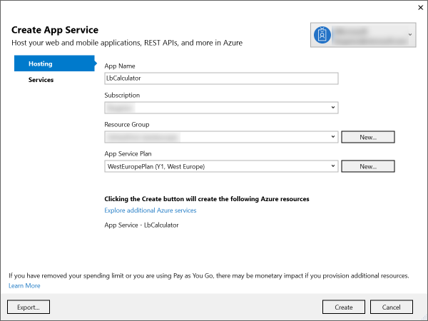

# Creating the Azure Function in Visual Studio

The great thing with the Azure tooling is that you can decide what tools you are more comfortable with. You can decide to [create the function in the Azure web portal](./creating.md), or you can take advantage of Visual Studio and its complete suite of tools, including unit testing, performance analysis, local debugging etc. In this section, we will show how the function can be created in Visual Studio, how to run the function locally to test it and how to publish it to Azure.

## Creating the function application

To create the function application in Visual Studio, you will need Visual Studio 2017. You can perform these steps in any edition of Visual Studio, [including the free Community edition](http://gslb.ch/a72). In the installer, make sure that the Azure development workload is installed.



1. Start Visual Studio 2017.

2. Select File > New > Project from the menu bar.

3. In the New Project dialog, select the Cloud category and then Azure Functions. 

4. Enter a name for the Function application. Note that you can have multiple functions in one Function application. Then press OK.

5. In the New Template dialog, select Http trigger and the following options:

    - Azure Functions v2 Preview (.NET Core). If you prefer, you can also select Azure Functions v1 (.NET Framework). The advantage of a .NET core function application is that it can run on servers with Linux. However some features are unavailable at this point.
    - Under Storage Account, select None. This particular sample doesn't require storage. However if your function needs data, tables, etc., you may want to connect it to an Azure Storage account.
    - Set Access rights to Function.



When the function application is created, it gives the default name "Function1" to the function. You will need to rename it to something more meaningful.

5. Rename the ```Function1.cs``` file to ```Add.cs```.

6. Open the ```Add.cs``` file in the code editor and modify the code as shown here:

```CS
public static class Add
{
    [FunctionName("Add")]
    public static IActionResult Run(
        [HttpTrigger(
            AuthorizationLevel.Function, 
            "get",
            Route = "add/num1/{num1}/num2/{num2}")]
        HttpRequest req, 
        int num1,
        int num2,
        TraceWriter log)
    {
        log.Info($"C# HTTP trigger function processed a request with {num1} and {num2}");

        var addition = num1 + num2;

        return new OkObjectResult(addition);
    }
}
```

There are a few interesting things about the code above:

- We changed the ```Run``` method's signature. The Azure Functions runtime will use this information to configure the service. First, we removed the ```"post"``` method because we want this function to only accept ```get``` methods. Then we modified the ```Route``` parameter of the ```HttpTrigger``` attribute. We declare the new route to be ```"add/num1/{num1}/num2/{num2}"```. In the client code, when we call the URL, we will replace ```{num1}``` with the first operand of the addition, and ```{num2}``` with the second operand.

- We declare two parameters named ```num1``` and ```num2``` of type ```int```. Conveniently, the Azure Functions runtime will automatically convert the ```{num1}``` and ```{num2}``` parts of the URL into the corresponding integers.

- We log an entry when the function is called. You can see the log entry in the debug window later, or in the Azure web portal. Logging can be very useful to debug some difficult issues.

- We then execute the addition with the two operands and return an ```OkObjectResult``` which will translate to an OK HTTP response .

> Note: since HTTP is a text-based protocol, the result of the addition will be returned to the client as text. [Later we will see how modern APIs use the JavaScript Object Notation (JSON)](./refactoring.md) to encode API inputs and outputs. JSON can easily be serialized and deserialized.

## Testing the function

One of the greatest advantages of Visual Studio over the Azure web portal for function creation and implementation is that you can run the function locally, which is very convenient for test purposes.

1. In the code editor, in Add.cs, place a breakpoint on the first line of the Run method, where the log call is placed.

2. Run the function in debug mode. This will start the Azure Functions runtime in a command window.

> Note: The Azure Functions runtime which is installed locally is an exact copy of the Azure Functions runtime running in Azure. This is not a simulator. This ensures that you get conditions as closed to reality as possible.

3. At the bottom of the command window, you will find the local URL of the function. Copy this URL which should be similar to ```http://localhost:7071/api/add/num1/{num1}/num2/{num2}```



4. Open a web browser window and paste the URL in the location bar.

5. In the URL, replace ```{num1}``` with an integer, for example 12. Then replace ```{num2}``` with another integer, for example 34. Then press Enter to load the page.

6. The application should break in the debugger in Visual Studio, at the breakpoint that you placed earlier. You can now inspect the ```num1``` and ```num2``` operands, and step through the function's code to debug it. Finally you should see the result, for example ```46``` in the web browser window.

## Publishing the function to Azure

Now that we have created and tested the function, we can publish it to Azure. In practice for larger applications, the Publishing step would be taken care of by a script and some tooling. Also, we wouldn't publish to a production server first, but we would deploy to a test server and run additional tests before moving the code to production.

In this simple sample, we will use the Publish feature of Visual Studio instead.

1. In the Solution Explorer, right click on the functions application and select Publish from the context menu.



2. In the next dialog, select Create New in order to create a new Functions application. In this dialog, you could also select an existing Functions application if you have one that you wish to replace.



3. In the Create Service dialog, set the following information:

- App Name: This is the name that will be used in the Azure portal.

> Note: The function's name should be unique and will appear in the function's URL. For example if the function is named LbCalculator, the domain will be https://lbcalculator.azurewebsites.net.

- Subscription: This is the Azure subscription that will be billed. Note that you can create a free subscription for trial at https://azure.microsoft.com/free

- Resource group: This is a logical grouping of your application's resources, to make it easier to manage them. You can create a new resource group or select am existing one.

- App service plan: This is the billing plan that you can use for this Azure Functions application. App Service plans can also be used for other app services such as web applications, web APIs, etc.



3. Click on the Create button. After the publication succeeds you will see a new dialog with information about the application.


## Getting the URL for the Xamarin client app

Later in the sample, we will need the URL of the service for our client app. Since all the communication between the client and the server happens over HTTP, the URL is the interface for it.

1. Log into the Azure web portal. In the menu on the left, select Function Apps.


2. Locate the functions application that you just published and click on the Add menu item.


3. Above the code editor window, click on the "Get function URL" button.


4. Copy the URL from the pop-up window and keep it safe for later.


## Conclusion

Our function's code is now complete and available for additional features in Visual Studio. We can now [move to the client's implementation](./first-client.md).

Later we will also refactor [the server](./refactoring.md) and [the client](./refactoring-client.md) to use JavaScript Object Notation JSON to communicate.