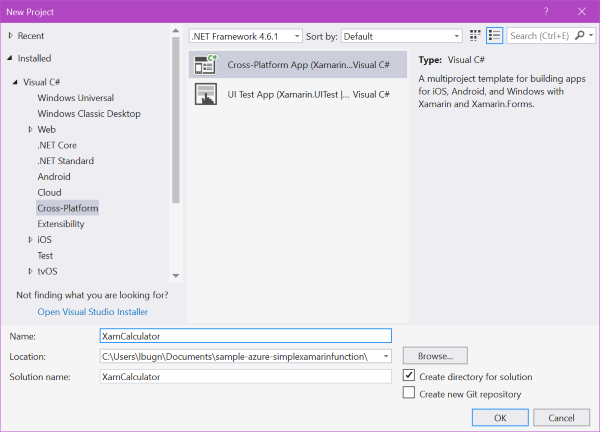

# Implementing the first version of the Xamarin.Forms client

We know that [our function works well now](./implementing.md), and we tested it in a web browser. Now we will build a Xamarin.Forms client that runs on iOS, Android and Windows to use this new API.

1. In Visual Studio 2017, select File, New, Project.

> Note: We use Visual Studio 2017 on Windows for this sample, but you can also create Xamarin.Forms applications in earlier versions of Visual Studio if you prefer. Xamarin is available for free in all versions of Visual Studio, including the free Community editions.
> - [Visual Studio Community Edition for Windows](https://www.visualstudio.com/vs/community/)
> - [Visual Studio for Mac](https://www.visualstudio.com/vs/visual-studio-mac/)

2. In the New Project dialog, select the Cross-Platform category, and then Cross-Platform App (Xamarin.Forms) with Visual C#. Name the new application ```XamCalculator```, select a location for the project and press OK.



> Note: The Cross-platform category is available if you selected the "Mobile development with .NET" workload in the Visual Studio 2017 installer.

3. In the New Cross Platform App dialog, select the following settings, then press OK.
    - Android, iOS and Windows
    - Xamarin.Forms
    - .NET Standard


The new application consists of 4 projects:

- XamCalculator: This is the shared user interface project, where we will implement the UI and the code calling the function. This project is referenced by each of the 3 other projects.
- XamCalculator.Android: The Android version of the application.
- XamCalculator.iOS: The iOS version of the application.
- XamCalculator.UWP: The Universal Windows Platform (UWP) of the application.

Later we will see how we can select each application to test it and run it.

4. In the XamCalculator project, select the MainPage.xaml and open it in the editor.

5. Replace the XAML code with the following:

```xml
<?xml version="1.0" encoding="utf-8" ?>
<ContentPage xmlns="http://xamarin.com/schemas/2014/forms"
             xmlns:x="http://schemas.microsoft.com/winfx/2009/xaml"
             xmlns:local="clr-namespace:XamCalculator"
             x:Class="XamCalculator.MainPage">

    <StackLayout VerticalOptions="Center"
                 HorizontalOptions="Fill">

        <Entry x:Name="Number1"
               Placeholder="Enter the first integer"
               PlaceholderColor="Gray" />

        <Entry x:Name="Number2"
               Placeholder="Enter the second integer"
               PlaceholderColor="Gray" />

        <Button Text="Add"
                x:Name="AddButton" />

        <Label x:Name="Result"
               FontSize="Large"
               HorizontalOptions="Center"
               Text="Ready for operation" />

    </StackLayout>
</ContentPage>
```

The code above creates a new user interface with 4 UI elements placed under each other. The layout is performed by the ```StackLayout``` panel. By default, the StackLayout uses a vertical layout, but it could also be changed to horizontal if needed. [There are many other layout types](https://developer.xamarin.com/guides/xamarin-forms/user-interface/controls/layouts/) that can be used to create more complex layouts.

- The first and second UI elements are [Entry controls](https://developer.xamarin.com/guides/xamarin-forms/user-interface/text/#Entry) where the user will be able to enter some text. We will access this text from the code behind. Note how we use the [Placeholder propert](https://developer.xamarin.com/guides/xamarin-forms/user-interface/text/entry/#Placeholders) to show a readonly text when the field is empty. The controls are named ```Number1``` and ```Number2```.

- The third element is a [Button control](https://developer.xamarin.com/api/type/Xamarin.Forms.Button/). This control can be clicked by the user, which will create an event that we will respond to. The button is named ```AddButton```.

- The last element is a [Label control](https://developer.xamarin.com/guides/xamarin-forms/user-interface/text/#Label), used to show some simple text output to the user. The Label is named ```Result```.

6. Open the MainPage.xaml.cs now. This C# code file is what we call "code behind". This is the view's controller, where we will handle events and modify the UI accordingly.

7. 