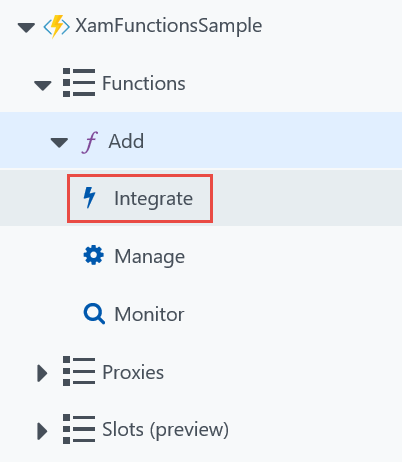
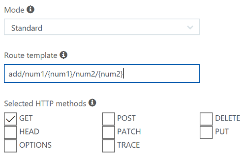

# Modifying the function's interface and implementing it

At this stage [we have created a basic function with the default implementation in the Azure portal](./creating.md). Now we are going to modify its interface to suit our purpose, and we will implement its code.

> Note: You can also create the Azure Function in Visual Studio 2017 if you prefer. [You can find a complete tutorial here](./creatingvs.md).

## Modifying the interface

At the moment, our function's URL looks something like:

```https://xamfunctionssample.azurewebsites.net/HttpTriggerCSharp/name/{name}?code=9r9jauRrThIFjGcP1nz3xRJLiriF9IAo5dmPlsLHBfS4hq0gv06E7A==```

What we need for our "Add" function however is two operands. We will call them ```num1``` and ```num2```. Also, the name ```HttpTriggerCSharp``` is not very descriptive and we will use a better name such as ```add```. So our target URL should be:

```https://xamfunctionssample.azurewebsites.net/api/add/num1/{num1}/num2/{num2}?code=9r9jauRrThIFjGcP1nz3xRJLiriF9IAo5dmPlsLHBfS4hq0gv06E7A==```

1. In the web portal, under the function's name, click on the Integrate menu item.



2. Modify the ```Route template``` to look like the following:

```
add/num1/{num1}/num2/{num2}
```



3. Click again on the name of the function, just above the Integrate menu item. This should display the code again in the editor window.

4. Modify the code to look like this:

```CS
using System.Net;

public static HttpResponseMessage Run(
    HttpRequestMessage req, 
    int num1,
    int num2,
    TraceWriter log)
{
    log.Info($"C# HTTP trigger function processed a request with {num1} and {num2}");

    // Fetching the name from the path parameter in the request URL
    return req.CreateResponse(HttpStatusCode.OK, $"Called {num1} + {num2}" );
}
```

The code above expects two parameters ```num1``` and ```num2``` of type ```int```. The mapping between the URL and the function's signature will be done by the Azure Functions runtime. 

## Testing the new signature

You can test the new signature with the following steps:

1. In the web portal, under the function's code, expand the Logs section.


2. Click again on the "Get function URL" button on the top right corner.

3. Copy the URL from the popup box. Notice that it should correspond to the URL we wanted to target earlier.

4. Paste the URL in the location bar of a new browser window.

5. Replace the ```{num1}``` parameter with an integer, for example ```12```.

6. Replace the ```{num2}``` parameter with another integer, for example ```34```.

7. Press enter to load the URL in the browser window. After a short wait, you should see the result:

```
Called 12 + 34
```

8. Switch back to the logs section in the function's browser window. You should see a log entry there looking like:

```
2017-12-27T13:30:05.126 Function started (Id=525c6fba-a346-4df7-a133-007660da482e)

2017-12-27T13:30:05.254 C# HTTP trigger function processed a request with 12 and 34

2017-12-27T13:30:05.254 Function completed (Success, Id=525c6fba-a346-4df7-a133-007660da482e, Duration=129ms)
```

In case there is an issue with the function, the log window will give additional indications. You can of course add more logging calls if necessary.

## Implementing the Add function

Now that we know that the function works with the new signature, we can implement the addition code:

1. Replace the function's body with the following code:

```CS
using System.Net;

public static HttpResponseMessage Run(
    HttpRequestMessage req, 
    int num1,
    int num2,
    TraceWriter log)
{
    log.Info($"C# HTTP trigger function processed a request with {num1} and {num2}");

    var addition = num1 + num2;

    // Fetching the name from the path parameter in the request URL
    return req.CreateResponse(HttpStatusCode.OK, addition);
}
```

2. Return to the previous browser window where we tested the function's signature before, and refresh the page. After a short wait, you should now see the result ```46```.

Interestingly, in the code above we simply declared that ```num1``` and ```num2``` are integers, and the Azure Functions runtime automatically parsed the values from the URL into integers for us. This is quite convenient.

## Getting the URL for the Xamarin client

Later in the sample, we will need the URL of the service for our client. Since all the communication between the client and the server happens over HTTP, the URL is the interface for it.

3. In the web portal, above the code editor window, click on the "Get function URL" button.


4. Copy the URL from the pop-up window and keep it safe for later.


## Conclusion

Our function's code is now complete. We can now [move to the client's implementation](./firstclient.md).

