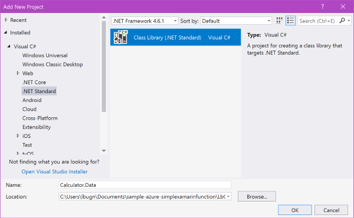
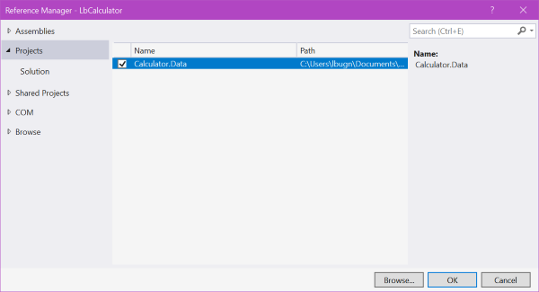
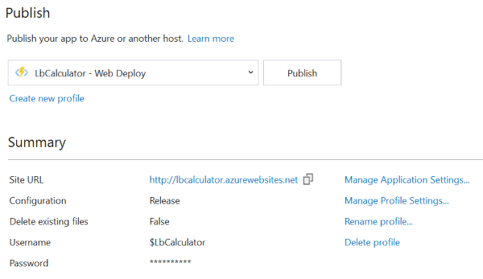

# Refactoring the Function to use JSON

One thing that we notice [when we use the Xamarin client](./first-client.md) is that the type of the result is ```System.String```. This is because we use HTTP to communicate between the client and the server, and HTTP (HyperText Transfer Protocol) is of course text-based. As such, it means that we need an additional agreement between the client and the server, to specify the type of the result, so that the client can parse it and convert the result to the desired type. If the server developer decides to change the implementation and the type of the result, or to add more information in the result, the client developer needs to be notified and update the application accordingly. This is not very efficient.

To avoid this kind of issues, many APIs these days use the JavaScript Object Notation JSON to encode the result of the function. JSON has various advantages: It is easy to serialize/deserialize and it can be transmitted as text over HTTP. We will now update our sample implementation to use JSON instead of a simple result.

> Note: Some APIs also use XML to transmit data. XML is also text-based, so it also works fine with HTTP. However XML is more verbose than JSON and thus is lost in popularity, especially for mobile clients.

## Adding a class library

In order to share code between the client and the server, we will use a class library that we will consume on the server and on the client. The class library can be seen as a contract between client and server. In this sample, we use .NET Standard for the Azure Function, so we will also create a .NET Standard class library. If you have selected a .NET Framework Azure Functions app, you can select a Portable Class Library here.

Follow the steps to add the class library to the server project:

1. Open the Functions application project in Visual Studio.

2. In the Solution Explorer, right click on the Solution name and select Add, New Project from the context menu.

3. In the Add New Project dialog, select the .NET Standard category on the left-hand side, and then Class Library (.NET Standard).

4. Enter a name (for example Calculator.Data) and a location for the new project.



5. In the Calculator.Data project, rename the file Class1.cs to AdditionResult.cs

7. Replace the class with the following code. For the sake of the sample, we will transmit the result of the addition as well as the current date/time on the server. We could also easily decide to transmit more information if necessary.

```CS
public class AdditionResult
{
    public int Result
    {
        get;
        set;
    }

    public DateTime TimeOnServer
    {
        get;
        set;
    }
}
```

## Consuming the class library on the server

Now that we have our new Data class library, we will use it on the server and modify the Function accordingly.

1. Right click on the LbCalculator Function project and select Add, Reference from the context menu.

2. In the Reference Manager dialog, select the Calculator.Data class library and press OK.



3. Reopen the Add.cs file in the Azure Function application.

4. Replace the ```Add``` class with the following code:

```CS
public static class Add
{
    [FunctionName("Add")]
    public static IActionResult Run(
        [HttpTrigger(
            AuthorizationLevel.Function, 
            "get",
            Route = "add/num1/{num1}/num2/{num2}")]
        HttpRequest req, 
        int num1,
        int num2,
        TraceWriter log)
    {
        log.Info($"C# HTTP trigger function processed a request with {num1} and {num2}");

        var result = new AdditionResult
        {
            Result = num1 + num2,
            TimeOnServer = DateTime.Now
        };

        return new OkObjectResult(result);
    }
}
```
There are a few small changes to the previous version of the function:

- The result is now an instance of the ```AdditionResult``` class that we added earlier in the ```Calculator.Data``` class library. Note how we also store the date/time on the server.

- Instead of the ```addition```, we pass the ```result``` instance to the ```OkObjectResult``` constructor now.

The ```result``` object will automatically be serialized to the JavaScript Object Notation JSON and passed back to the caller.

## Testing the new interface

Now we can test the new function result in the web browser.

1. In Visual Studio, select Debug, Start without Debugging from the menu bar.

2. In the Command window with the Azure Runtime that opens up, copy the debug URL from the ```Http Function``` section (in green).

3. Like before, paste the debug URL in a web browser and replace the ```{num1}``` and ```{num2}``` occurrences in the URL with operands, for example ```12``` and ```34```.

4. In the web browser, you should now see a result looking like

```json
{"Result":46,"TimeOnServer":"2018-01-08T10:11:54.5719894-08:00"}
```

## Publishing the new function to Azure

Now that the code changed, we will publish the updated function to Azure. The process is easier [than the first time we did that](./creating-vs.md#publishing-the-function-to-azure), because we don't have to specify all the parameters again. 

1. In Visual Studio, in the Solution Explorer, right click on the Azure functions application name and select Publish from the context menu.

If everything went well before, the publication parameters should be all saved and available in Visual Studio. You should see something similar to the image below:



If you don't see something like that, you might have to re-publish the application to Azure. Follow the steps we did earlier, and select the existing functions application instead of creating a new one from scratch.

2. Press on the Publish button. You can see the progress in Visual Studio's Output window.

3. After a short while, the changes are published to Azure. You can test the new function's interface by using [the exact same URL we obtained before from the Azure web portal](./creating-vs.md#getting-the-url-for-the-xamarin-client-app). Simply reload this URL in the web browser, and you should now see a JSON formatted result, including the date/time on the server.

> Note: If you are observant, you might notice that the date/time returned by the server is always the UTC date/time, even if you selected a different region when you created the functions application. This is because all Azure servers run in UTC date/time, to make it easier to let applications communicate with each other.

## Conclusion

Now that we saw that the new interface of the Azure function works fine, and the function now returns a JSON-formatted result. [We can now modify the Xamarin.Forms client](./refactoring-client.md) to take advantage of the new result.